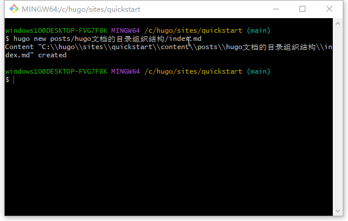

#### hugo文档的目录组织结构

* 在posts目录下直接保存markdow文档
* 在posts目录下以文档名新建目录，在这新建的目录下新家index.md，新建一个image目录来保存文章引用的图片资源。
  * 因为index.md和image是同一个层级的结构，无论是在front matter区域的featured_image，还是正文区域的图片，都可以直接引用这个同级目录下保存的资源文件。

如下图所示：

也就是以目录的形式来组织文档，不仅层次分明，而且引用的图片也可以得到正确渲染。
