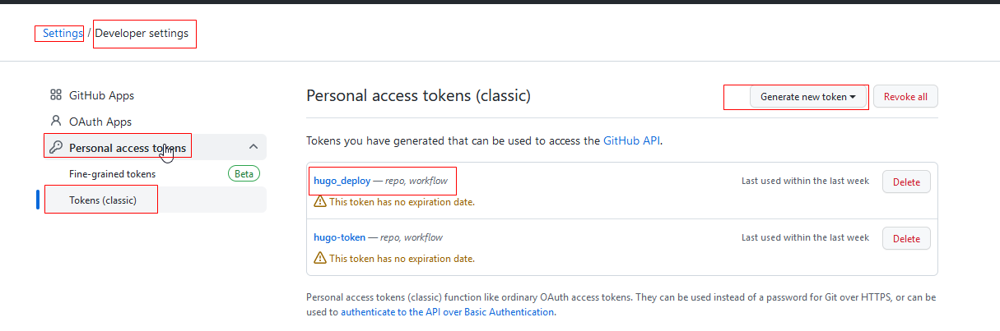
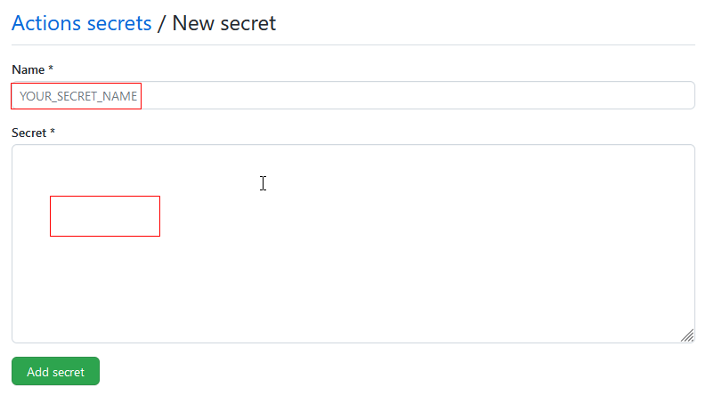

####  使用github的actions flow把hugo博客自动化部署到github

部署静态博客站点到github一般有两种方法，第一种是手动建立项目，添加文档，最后使用git命令部署到github仓库。第二种方法是使用github提供的actions  flow实现自动化部署，一般可以通过两个分支来实现。

* 一个分支保存项目源文件、

  一般为main分支，把项目的源文件推送到这个分支，既可以保存源文件，又可以从这里开始执行自动化部署到本仓库的另外一个分支。
  
* 手动建立一个独立的gh-pages分支
  
  ~~~
  git   checkout --orphan gh-pages
  echo  "hello gh-pages" > readme.md
  git  add .
  git commit -m  "udpate with orphan branch gh-pages"
  git push origin gh-pages
  git  branch -a  --经过上面的创建新的独立分支到最后的提交、推送，到这里才可以看到这个新建的分支
  -- 然后可以把gh-pages分支下除了.git目录之外的所有目录和文件删除，推送到远程，专门来保存自动部署生成的静态站点文件
  -- 当然可以试一下不必手动删除这些目录和文件，看看系统是不是会自动清理删除这些目录和文件。
  
  ~~~
  
* 编写actions自动部署脚本

  * 首先在项目的根目录下新建脚本文件：.github\workflows\hugo-actions.yml。如果提示不能新建.开头的目录，就从别的地方复制过来，编辑一下路径和文件名。

  ```
  name: Deploy Hugo  
  
  on:
    push:
      branches:
        - main   
  
  jobs:
    build-deploy:
      runs-on: ubuntu-18.04
      steps:
        - uses: actions/checkout@v1
  
        - name: Setup Hugo
          uses: peaceiris/actions-hugo@v2
          with:
            hugo-version: latest
  
        - name: Build 
          run: hugo
  
        - name: Deploy
          uses: peaceiris/actions-gh-pages@v3
          with:
            personal_token: ${{ secrets.HUGODEPLOYBTTWOBRANCHS }} 
            PUBLISH_BRANCH: gh-pages  
            PUBLISH_DIR: ./public  
            commit_message: ${{ github.event.head_commit.message }}
  ```

* personnal access token和secrets
   * 在上面的脚本Deploy部分，HUGODEPLOYBTTWOBRANCHS是在github的账户setting->developer setting 下面新建的personal access token:

  

  * 进入到hugo 项目仓库，然后选择secrets，新建仓库的secrets，填写名称，secret的内容是上一步新建的personal access token的内容，粘贴在这里保存即可，在action脚本里引用时，用${{ secrets.HUGODEPLOYBTTWOBRANCHS }}的写法就可以获取token的值。
  
    
也就是说，仓库的secrets读取的是github账号级别的personal access token。
