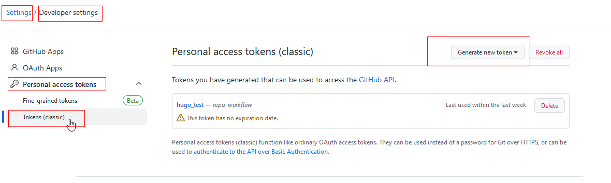
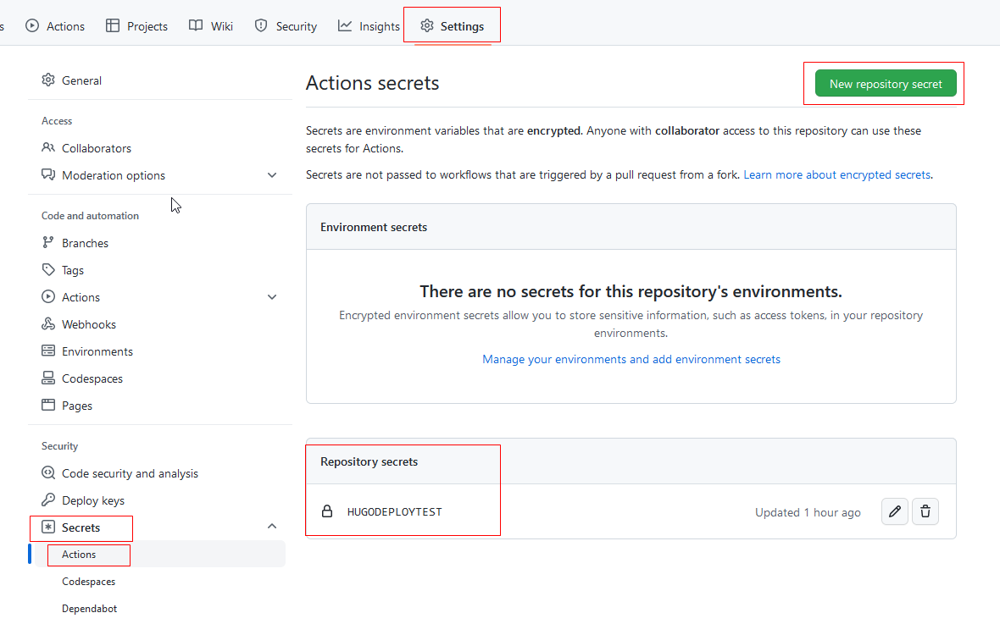

#### 使用自定义的actons workflow,在仓库的两个分支之间实现hugo博客站点自动化部署

##### **使用github personal access token 和仓库的secrets在两个分支之间实现博客站点自动化部署**

用仓库的main分支保存博客项目源文件，手动建立独立分支gh-pages保存编译后的静态文件。这里依然以username.github.io形式的仓库为例。自己手动建立独立的gh-pages分支。

* 在github上新建username.github.io形式的空仓

* 在本地根据hugo官网推荐的QuickStart入门教程，建立Hugo博客项目

  ~~~·
  hugo  new   site  hugo
  cd hugo 
  git  init
  git  submodule add https://github.com/theNewDynamic/gohugo-theme-ananke.git  themes/ananke
  编辑config.toml文件，在最后新增  theme  =  "ananke"
  修改baseURL = "https://username.github.io"
  hugo  new  posts/文档名称作为目录名/index.md    --编辑自己的文档
  git  add .
  git  commit -m   "新增文档"
  git  push  -u origin  main --第一次推送到空仓username.github.io时要带上-u参数，以后不需要带-u参数
  ~~~
  
* 在本地新建一个独立分支gh-pages

  ~~~
  git  checkout  --orphan gh-pages
  echo  "hello github gh-pages" > readme.md 
  git  add .
  git commit -m "add gh-pages branch"
  git push origin gh-pages   --在新建分支后推送到远程仓库分支，要指定源分支，系统会自动建立同名分支，并建立关联。以后再推送分支可以不必再指定源分支。
  git  branch -a   --此时就可以看到新建的独立分支gh-pages。如果不在新建的分支下增加变化并git-add-commit-push ，就不会真正建立分支。
  ~~~

  经过上面两个步骤，username.githbu.io仓库有两个分支：main 、gh-pages。建立并切换到gh-pages分支时，会自动复制main分支的目录和文件，除了.git目录之外，把所有其他目录和文件都删除，然后git-add-commit-push，远程仓库的gh-pages没有别的文件，只用来保存静态的博客站点网页文件。

* 设置github-token和仓库的action secrets

  * 这里使用github账户下setting的 personal access tokens作为发布秘钥，在源文件仓库（执行 Github Actions 的仓库）私钥里读取这个token。

  
  生成新的tokens之后，立刻复制保存在记事本里。

  * 选择仓库的settings,选择Secrets,Actions，添加仓库Secret,名称设置为：HUGODEPLOYTEST，内容复制前面新生成的token值。

    

* 在博客项目根目录下建立一个actions  workflow文件(如果新建.github目录时提示不能建立，就从别处复制一个)，路径为：.github/workflows/hugo.yml  ,文件内容如下（https://gohugo.io/hosting-and-deployment/hosting-on-github/，这里的action内容来自hugo官网）

  
  

  ~~~
  name: github pages
  
  on:
    push:
      branches:
        - main  # Set a branch to deploy
    pull_request:
  
  jobs:
    deploy:
      runs-on: ubuntu-22.04
      steps:
        - uses: actions/checkout@v3
          with:
            submodules: true  # Fetch Hugo themes (true OR recursive)
            fetch-depth: 0    # Fetch all history for .GitInfo and .Lastmod
  
        - name: Setup Hugo
          uses: peaceiris/actions-hugo@v2
          with:
            hugo-version: 'latest'
            # extended: true
  
        - name: Build
          run: hugo --minify
  
        - name: Deploy
          uses: peaceiris/actions-gh-pages@v3
          if: github.ref == 'refs/heads/main'
          with:
            github_token: ${{ secrets.GITHUB_TOKEN }} 
            publish_dir: ./public
  ~~~
  [GitHub pages setting](https://gohugo.io/hosting-and-deployment/hosting-on-github/#github-pages-setting)

  ~~~
  GitHub pages setting
  
  By default, the GitHub action pushes the generated content to the gh-pages branch. This means GitHub has to serve your gh-pages branch as a GitHub Pages branch. You can change this setting by going to Settings > GitHub Pages, and change the source branch to gh-pages.
  Change baseURL in config.toml
  
  Don’t forget to rename your baseURL in config.toml with the value https://<USERNAME>.github.io for your user repository or https://<USERNAME>.github.io/<REPOSITORY_NAME> for a project repository.
  
  Unless this is present in your config.toml, your website won’t work.
  ~~~

* 最后推送整个博客项目到username.github.io仓库的main分支，github后台会自动运行上面的actions workflows文件，完成博客项目静态站点网页部署。由于已经使用了github推荐的hugo action，可以正确的自动化发布博客项目，所有这个workflows就没有再实际测试，记录在这里备忘，以后有兴趣的可以再尝试。

